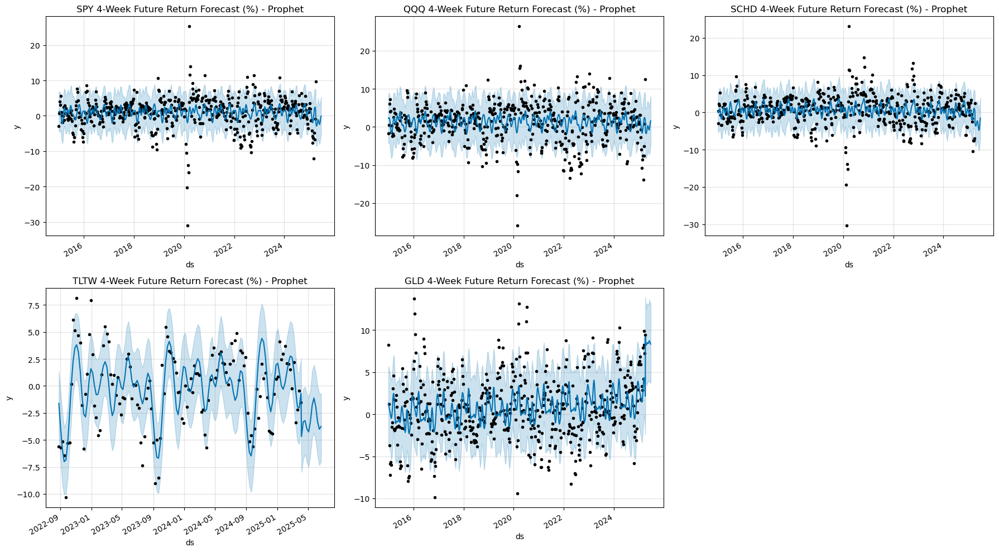
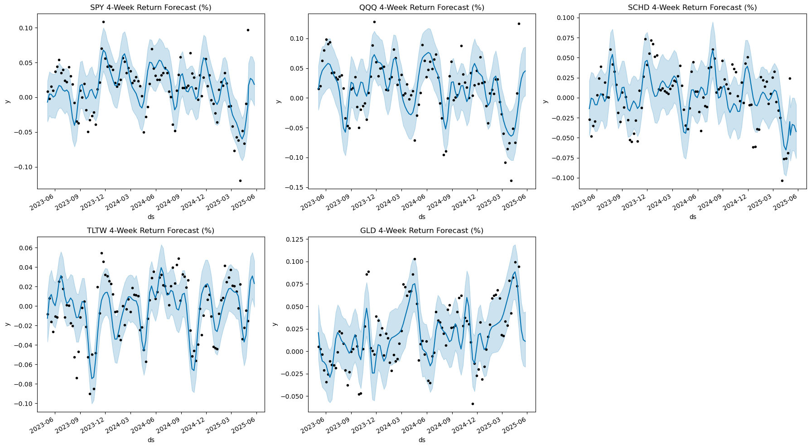

# Portfolio-Investment-Strategy-using-Prophet-Model
## Summary
This project demonstrates a project for evaluating and optimizing ETF investment strategies using prophet forecast based rebalancing. Dollar Cost Averaginf Period is optimized using parameters Sharpe and Sortino Ratio. Based on Optimized Strategy, dynamic rebalancing suggestions are given.

---

##  Project Goals

- Create a Prophet based forecast model to predict short-term return (4week-ahead)
- Compare lump sum vs. DCA rebalancing strategies
- Evaluate performance with risk-adjusted metrics (Sharpe, Sortino, and etc)
- Recommend ETF allocation and share purchase quantities

---

## Project Overview

### 1. Data Collection & Preprocessing

- Loaded weekly ETF price data from 5 ETFs: `SPY`, `QQQ`, `SCHD`, `TLTW`, `GLD`. (5 ETFs forming up portfolio)
- Adj_Close used to reflect Dividends and Splits of ETFs.
- Created engineered features: 4-week forward returns, price returns
- Integrated macroeconomic features (e.g. `fed_rate`) to use as regressor in prophet model

### 2. Forecast Modeling with Prophet

- Trained individual Prophet models per ETF on their 4-week return
- Applied custom `changepoint_prior_scale` and fed_rate as regressor to find optimized prophet model
- Exported forecasted returns into separate CSVs for investment simulation, and showed enhanced MAE of optimized prophet model.

### 3. 💰 Strategy Simulation & Backtesting

- Simulated multiple investment strategies:
  - Lump Sum Investment
  - Optimized Lump Sum Allocation
  - DCA Rebalancing every 2/4/6 months
  - Forecast-weighted DCA based on expected returns

- Calculated cumulative return, annual return, volatility, drawdown, Sharpe and Sortino ratios

### 4. 📊 Portfolio Rebalancing Logic

- Defined current ETF holdings (number of shares)
- Forecasted ETF return weights were used to allocate new investment (e.g., $3000)
- Rounded share purchase quantities to nearest integers
- Tracked remaining uninvested cash
- Calculated final portfolio percentages

### 5. 📋 Reporting & Visualization

- Generated styled tables to:
  - Compare strategy performance metrics
  - Display share purchase recommendations
  - Highlight best-performing strategies

- Used `pandas.style` for:
  - Gradient bars on annual return and drawdown
  - Sharpe/Sortino highlighting
  - Bordered rows for optimal strategies

---

## 🔍 Sample Output

| Strategy | Annual Return | Sharpe Ratio | Sortino Ratio |
|----------|----------------|--------------|---------------|
| Lump Sum Optimized ✅ | 12.5% | **1.43** | 2.10 |
| DCA Forecast-Based (2 Months) ⭐ | 11.7% | **1.38** | 2.05 |

---

## 🛠 Technologies Used

- Python, Jupyter Notebook
- `pandas`, `Prophet`, `matplotlib`, `numpy`
- `pandas.style` for visual reporting
- Optional: `plotly`, `tabulate`, `lux`, `openpyxl`

---

## 📂 Folder Structure

