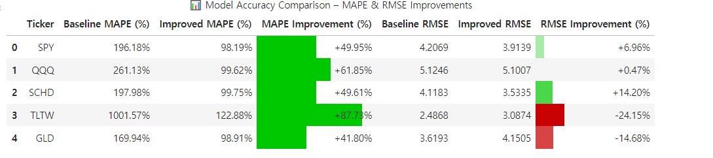
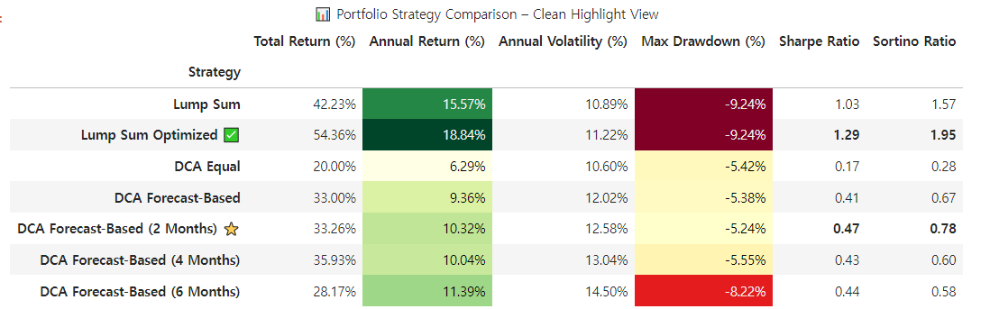
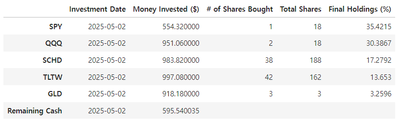

# Portfolio-Investment-Strategy-using-Prophet-Model
## Summary
This project focuses on evaluating and optimizing ETF investment strategies through forecast-based rebalancing using Prophet. The Dollar Cost Averaging (DCA) interval is optimized based on risk-adjusted performance metrics, specifically Sharpe and Sortino ratios. The final model provides dynamic rebalancing recommendations aligned with the selected optimal strategy.

---

##  Project Goals

- Create a Prophet based forecast model to predict short-term return (4week-ahead)
- Compare lump sum vs. DCA rebalancing strategies
- Evaluate performance with risk-adjusted metrics (Sharpe, Sortino, and etc)
- Recommend ETF allocation and share purchase quantities

---

## Project Overview

### 1. Data Collection & Preprocessing

- Loaded weekly ETF price data from 5 ETFs: `SPY`, `QQQ`, `SCHD`, `TLTW`, `GLD`. (5 ETFs forming up portfolio)
- Adj_Close used to reflect Dividends and Splits of ETFs.
- Created engineered features: 4-week forward returns, price returns
- Integrated macroeconomic features (e.g. `fed_rate`) to use as regressor in prophet model

### 2. Forecast Modeling with Prophet

- Trained individual Prophet models per ETF on their 4-week return
- Applied custom `changepoint_prior_scale` and fed_rate as regressor to find optimized prophet model
- Exported forecasted returns into separate CSVs for investment simulation, and showed enhanced MAE of optimized prophet model.

### 3. Strategy Simulation & Backtesting
To investigate best strategies for investment, multiple strategies are simulated under following Condtions:
1. Investment Period: 2022-09-01 to 2025-05-02
2. Invested Cash: $1500 monthly for DCA and $48000 for Lump Sum
3. Simulated strategies:
  - Lump Sum Investment
  - Optimized Lump Sum Allocation
  - DCA Rebalancing every 1/2/4/6 months
Among all strategies, Optimized Lump Sum strategies showed the best total return (with allocations of SPY: 29.20% QQQ: 19.01% SCHD: 10.96% TLTW: 10.91% GLD: 29.92%)

After simulating various strategies, key performance metrics—cumulative return, annual return, volatility, drawdown, Sharpe ratio, and Sortino ratio—were calculated for comparison. While the Lump Sum strategy achieved the highest returns and risk-adjusted performance, it also carried greater drawdown and requires large upfront capital. Therefore, this project adopts the DCA with 2-month rebalancing strategy, which demonstrated the strongest Sharpe and Sortino ratios among all DCA methods, offering a more practical and balanced approach for most investors.

### 4. Portfolio Rebalancing Logic
Finally, the model uses current ETF holdings and a new investment amount (e.g., $3000) to generate a realistic and actionable rebalancing plan. Key steps include:
- Defining current ETF holdings in number of shares
- Applying forecast-based weights to allocate new capital
- Rounding share purchases to the nearest whole number
- Tracking any remaining uninvested cash
- Calculating updated portfolio composition by percentage of total value

## Technologies Used

- Python, Jupyter Notebook
- `pandas`, `Prophet`, `matplotlib`, `numpy`, 'Scikit-Learn'
- `pandas.style` for visual reporting

